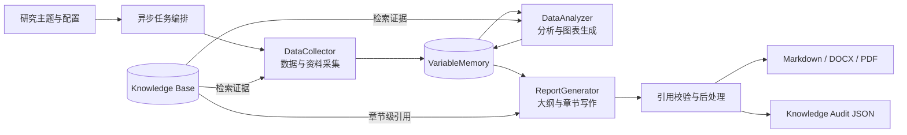
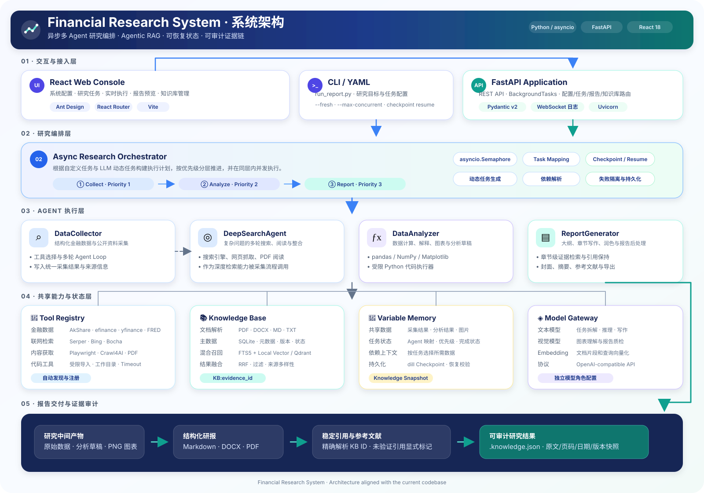
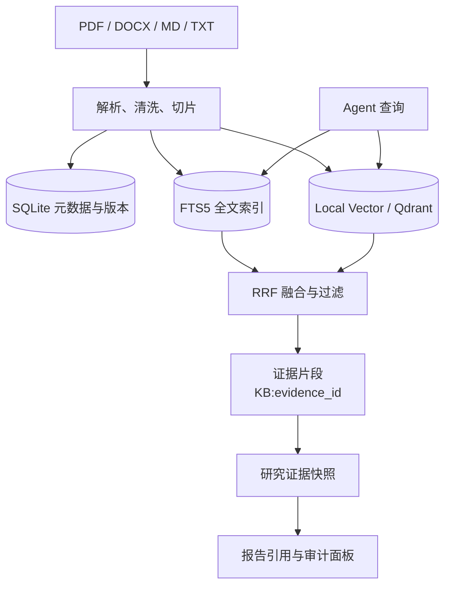

<div align="center">
  

  <h1>Financial Research System</h1>
  <p><strong>面向公司、行业与宏观研究的多 Agent 金融研报生成与知识库系统</strong></p>
  <p>从资料采集、深度检索和数据分析，到图表生成、证据引用与研报导出，一条工作流完成。</p>

  <p>
    
    
    
    
    
  </p>

  <p>
    <a href="#-核心能力">核心能力</a> ·
    <a href="#-系统架构">系统架构</a> ·
    <a href="#-快速开始">快速开始</a> ·
    <a href="#-知识库与证据链">知识库</a> ·
    <a href="#-报告示例">报告示例</a> ·
    <a href="#-项目文档">项目文档</a>
  </p>
</div>

---

## 📌 项目简介

Financial Research System 是一个面向金融研究场景的异步多 Agent 系统。用户提供公司、股票、行业或宏观研究主题后，系统会拆解研究任务，调用金融数据与网页检索工具，执行 Python 数据分析并生成图表，最终输出结构化 Markdown、DOCX 和 PDF 研报。

项目内置可审计知识库：研究者可以上传 PDF、DOCX、Markdown 和 TXT 资料，通过全文检索与向量检索召回证据，并在最终报告中保留稳定的 `[KB:evidence_id]` 引用。每次研究都会固化证据快照，便于回溯当时使用的原文、版本、发布日期和页码。

<table>
  <tr>
    <td align="center" width="25%"><strong>🤖 多 Agent 研究</strong><br/>采集、分析、写作分工协作</td>
    <td align="center" width="25%"><strong>📚 Agentic RAG</strong><br/>混合检索与按章节补充证据</td>
    <td align="center" width="25%"><strong>📊 数据与图表</strong><br/>受限 Python 执行器完成分析</td>
    <td align="center" width="25%"><strong>🔎 可追溯引用</strong><br/>证据编号、快照与审计文件</td>
  </tr>
</table>

## ✨ 核心能力

| 能力 | 实现方式 | 产生的结果 |
| --- | --- | --- |
| 自动化研究流水线 | `DataCollector → DataAnalyzer → ReportGenerator` 分阶段执行，同阶段任务受信号量控制并发 | 从研究问题到完整报告 |
| 金融数据采集 | 集成 AkShare、efinance、yfinance、FRED 等数据工具 | 行情、财务、宏观与行业数据 |
| 联网深度检索 | 支持 Serper、Bing、Bocha，以及 Playwright、Crawl4AI 和 PDF 解析 | 新闻、公告、网页与文档资料 |
| 数据分析与绘图 | LLM 生成分析代码，受限执行器限制导入、写入目录与执行时间 | 指标分析、表格和可视化图表 |
| 知识库入库 | PDF、DOCX、MD、TXT 解析，内容哈希去重、版本与状态管理 | 可管理、可检索的研究资料库 |
| 混合检索 | SQLite FTS5 关键词召回 + 本地向量或 Qdrant + RRF 融合 | 兼顾中文关键词与语义相关性 |
| 证据链 | 稳定证据编号、精确引用解析、研究快照、`.knowledge.json` 审计文件 | 报告结论可定位到原始证据 |
| 断点恢复 | `VariableMemory` 持久化任务、数据、依赖、日志与知识快照 | 长任务失败后可继续执行 |
| 可视化管理 | React + Ant Design 管理配置、任务、日志、报告与知识库 | 浏览器内完成主要操作 |
| 多格式交付 | Markdown 原稿，经 Pandoc/docx2pdf 转换 | Markdown、DOCX、PDF 报告 |

## 🧭 工作流程



系统按任务优先级依次推进：优先级 1 负责采集，优先级 2 负责分析，优先级 3 负责报告生成；同一优先级中的任务可并发运行。任务结果统一写入 Variable Memory，后续 Agent 根据显式依赖读取数据，减少上下文重复传递。

## 🏗️ 系统架构

<p align="center">
  
</p>

架构图依据当前代码绘制，覆盖 Web 与 CLI 入口、FastAPI 服务、异步优先级编排、Agent 执行层、共享工具与状态，以及知识库证据审计和多格式报告交付。

### Agent 分工

| Agent | 主要职责 | 常用工具或上下文 |
| --- | --- | --- |
| `DataCollector` | 拆解采集任务，获取结构化金融数据与公开资料 | 金融 API、搜索、浏览器、PDF 解析、知识库 |
| `DeepSearchAgent` | 对复杂问题进行多轮检索、阅读与信息整合 | 搜索引擎、网页抓取、长文本处理 |
| `DataAnalyzer` | 根据已有数据编写和执行分析代码，产出结论与图表 | pandas、NumPy、Matplotlib、受限 Python 执行器 |
| `ReportGenerator` | 生成大纲与章节，整合分析结果，处理引用与格式 | Variable Memory、知识证据、VLM、模板 |

项目采用自研 `BaseAgent` 和 Agent Loop，没有依赖 LangChain、LangGraph、CrewAI 或 AutoGen。工具通过注册机制暴露给 Agent，模型通过 OpenAI-compatible API 接入，可分别配置文本模型、视觉模型和 Embedding 模型。

## 📚 知识库与证据链

知识库既可以与联网工具共同使用，也可以启用“仅知识库”模式，让文字研究只使用选中资料库中的证据。



知识库支持：

- 内容哈希去重、不可变文档记录、解析失败重试与重新索引；
- 资料库、公司、证券代码、市场、行业和披露截止日期过滤；
- 中文关键词检索，以及配置 Embedding 后的关键词与语义混合检索；
- PDF 物理页码、DOCX/Markdown 章节与段落定位；
- 删除后停止参与新检索，同时保留历史任务快照用于审计；
- 在报告预览中展开证据原文、来源、日期、版本和定位信息。

详细说明请阅读 [知识库使用文档](docs/KNOWLEDGE_BASE.md)。

## 🖥️ 报告示例

### 公司研究报告

<p align="center">
  
</p>

### 行业研究报告

<p align="center">
  
</p>

可直接查看仓库中的示例 PDF：

- [中国移动公司研究报告](assets/example_reports/ChinaMobile.pdf)
- [泡泡玛特公司研究报告](assets/example_reports/PopMart.pdf)
- [商汤科技公司研究报告](assets/example_reports/SenseTime.pdf)
- [优然牧业公司研究报告](assets/example_reports/YouranDairy.pdf)
- [金融 Agent 行业研究报告](assets/example_reports/Financial_Agent_Industry.pdf)

> 示例报告用于展示系统输出形式，不构成投资建议；其中的观点、数据与结论应结合原始来源重新核验。

## 🚀 快速开始

### 1. 环境要求

- Python 3.10+，推荐 Python 3.11
- Node.js 18+
- 可访问的 OpenAI-compatible 文本模型与视觉模型服务
- Embedding 模型可选；不配置时知识库仍可使用关键词检索
- 完整 DOCX/PDF 转换需要 Pandoc，以及 docx2pdf 所需的系统文档转换环境

### 2. 克隆与安装

```bash
git clone git@github.com:Liousesixteen/Financial-Research-System.git
cd Financial-Research-System

python3.11 -m venv .venv
source .venv/bin/activate
pip install -r requirements.txt -r requirements-knowledge.txt

npm ci --prefix demo/frontend
```

### 3. 配置模型与搜索服务

```bash
cp .env.example .env
```

编辑 `.env`，至少配置研究所需的文本模型；下列服务均采用 OpenAI-compatible 接口：

```dotenv
DS_MODEL_NAME=your-text-model
DS_BASE_URL=https://your-provider.example/v1
DS_API_KEY=your-api-key

VLM_MODEL_NAME=your-vision-model
VLM_BASE_URL=https://your-provider.example/v1
VLM_API_KEY=your-api-key

EMBEDDING_MODEL_NAME=your-embedding-model
EMBEDDING_BASE_URL=https://your-provider.example/v1
EMBEDDING_API_KEY=your-api-key

SERPER_API_KEY=your-search-api-key
```

### 4. 启动 Web 应用

后端：

```bash
source .venv/bin/activate
python -m uvicorn demo.backend.app:app --host 127.0.0.1 --port 8000
```

前端：

```bash
npm run dev --prefix demo/frontend -- --host 127.0.0.1
```

打开 [http://127.0.0.1:3000](http://127.0.0.1:3000)，知识库页面位于 `/#knowledge`。

### 5. 运行命令行研报任务

复制并修改示例配置：

```bash
cp docs/example_configs/my_config_company.yaml my_config.yaml
python run_report.py --config my_config.yaml --fresh
```

`--fresh` 会创建新的研究与证据快照；省略后，系统会尝试从已有检查点恢复。

## ⚙️ 知识库配置示例

在研究 YAML 中加入以下配置：

```yaml
knowledge_base:
  enabled: true
  kb_ids:
    - "your-library-id"
  mode: hybrid                 # hybrid 或 knowledge_only
  as_of: "2026-06-30"
  top_k: 8
  vector_backend: local        # local 或 qdrant
  embedding_model: "your-embedding-model"
  embedding_version: "1"
  filters:
    ticker: "600001"
    market: "A"
```

知识库也提供独立服务，不配置生成模型即可体验资料管理与关键词检索：

```bash
python -m uvicorn demo.backend.knowledge_app:app --host 127.0.0.1 --port 8000
```

CLI 示例：

```bash
python -m src.knowledge create "公司公告库"
python -m src.knowledge list
python -m src.knowledge ingest <library-id> ./annual-report.pdf
python -m src.knowledge search <library-id> "毛利率下降原因"
```

如需 Qdrant：

```bash
docker compose -f compose.knowledge.yaml up -d
```

## 🧰 技术栈

| 层次 | 技术 |
| --- | --- |
| Agent 与编排 | Python、asyncio、自研 BaseAgent、工具注册、优先级任务流、Checkpoint |
| 模型接入 | OpenAI Python SDK、OpenAI-compatible API、文本模型、VLM、Embedding |
| 数据分析 | pandas、NumPy、Matplotlib、Seaborn |
| 金融与检索 | AkShare、efinance、yfinance、FRED、Serper、Bing、Bocha |
| 网页与文档 | Playwright、Crawl4AI、BeautifulSoup、pdfplumber、python-docx |
| RAG 与存储 | SQLite、FTS5、jieba、本地向量检索、Qdrant、RRF |
| 后端 | FastAPI、Uvicorn、Pydantic、WebSocket |
| 前端 | React 18、Vite 5、Ant Design、React Router、Axios、React Markdown |
| 测试 | pytest、pytest-asyncio、Hypothesis、httpx |
| 交付 | Markdown、Pandoc、DOCX、PDF、Docker Compose |

## 📁 项目结构

```text
Financial-Research-System/
├── run_report.py                 # CLI 研报流水线入口
├── src/
│   ├── agents/                   # 采集、深搜、分析、报告 Agent
│   ├── tools/                    # 金融、搜索、抓取、代码执行工具
│   ├── memory/                   # Variable Memory 与任务恢复
│   ├── knowledge/                # 入库、检索、API、Agent 证据接入
│   ├── config/                   # 模型与研究任务配置
│   └── template/                 # 公司、行业研报模板
├── demo/
│   ├── backend/                  # FastAPI、WebSocket、知识库接口
│   └── frontend/                 # React + Ant Design 管理界面
├── docs/                         # 使用说明、面试解析与示例配置
├── tests/                        # Agent、工具、记忆与知识库测试
├── assets/                       # 品牌、架构图和示例报告
└── compose.knowledge.yaml        # 可选 Qdrant 服务
```

## ✅ 测试

知识库与前端的核心检查：

```bash
python -m pytest tests/knowledge -q
npm run build --prefix demo/frontend
```

覆盖范围包括文档解析、去重、过滤、混合检索、稳定证据编号、删除语义、任务快照、Agent 接入和恢复逻辑。完整测试命令及当前已知边界见 [知识库文档](docs/KNOWLEDGE_BASE.md#5-测试与已知边界)。

## 🗺️ 后续计划

- [ ] 扫描 PDF OCR 与复杂跨页表格重建
- [ ] Excel 指标仓库和指标口径管理
- [ ] 大规模知识库召回与延迟基准
- [ ] 生产级异步任务队列与多用户权限
- [ ] Agent 评测、链路追踪与研究质量看板
- [ ] 知识图谱与跨报告实体关联

## 📖 项目文档

| 文档 | 内容 |
| --- | --- |
| [知识库使用说明](docs/KNOWLEDGE_BASE.md) | 安装、入库、检索、Agent 接入、审计与边界 |
| [高级用法](docs/ADVANCED_USAGE.md) | 自定义 Agent、工具、数据与报告流程 |

## ⚠️ 使用边界

当前实现主要面向本机单用户研究。知识库任务恢复采用单进程设计，完整后端请使用单个 worker。受限 Python 执行器提供导入、目录和超时控制，但不等同于容器或虚拟机级安全隔离。对外提供服务前，应补充身份认证、权限控制、密钥管理、网络隔离与独立执行沙箱。

本项目生成的内容仅用于技术研究与信息整理，不构成任何投资建议。金融数据可能存在延迟、遗漏或口径差异，使用者应核对原始公告和权威数据源。

## 📄 License

本项目按 [GNU General Public License v3.0](LICENSE) 发布。

---

<div align="center">
  <strong>Financial Research System</strong><br/>
  让金融研究过程可编排、可恢复、可检索、可追溯。
</div>
