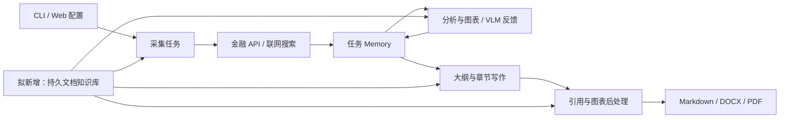

# Financial Research System 知识库接入方案（已实现）

## 1. 推荐结果

在现有研报系统中增加可跨任务复用的文档知识库。用户上传年报、公告、行业研究和内部材料，按公司、行业、报告期筛选；研究时由系统检索原文证据，再结合联网采集的数据形成报告，引用可定位到具体文档版本和页码。

第一版按本机单用户研究场景设计。优先支持文本型 PDF、DOCX、Markdown、TXT，保留普通表格结构。扫描件 OCR、复杂跨页财务表、Excel 指标库和知识图谱后续增加。资料规模尚未知，以 100–500 份文档作为首轮验证规模，不预先承诺大规模性能。

## 2. 当前项目框架

| 层 | 主要代码 | 实际职责 |
|---|---|---|
| CLI 编排 | `run_report.py` | 配置加载、生成补充任务、创建 Agent；采集/分析/报告按优先级先后运行，同级并发，支持恢复 |
| Web 编排 | `demo/backend/app.py` | FastAPI 配置与任务接口、执行状态、WebSocket 日志、报告预览下载；独立实现一套报告调度 |
| 前端 | `demo/frontend/src/App.jsx`、`pages/` | React 18 + Vite + Ant Design；配置、任务、执行、报告四个主要页面，中英文文案 |
| 配置 | `src/config/config.py` | 合并默认 YAML、用户文件和字典配置，解析环境变量，初始化模型与限流器，设置工作目录 |
| Agent 基类 | `src/agents/base_agent.py` | 模型调用、动作解析、工具调用、代码执行、检查点保存恢复 |
| 采集 | `src/agents/data_collector/data_collector.py` | 注册金融 API 工具及 DeepSearchAgent，将数据保存为 ToolResult |
| 网络研究 | `src/agents/search_agent/search_agent.py` | 默认 Serper 搜索与网页读取，跟踪搜索链接与已读取来源 |
| 分析 | `src/agents/data_analyzer/data_analyzer.py` | 读取采集数据、Python 分析、图表生成及 VLM 反馈，形成 AnalysisResult |
| 报告 | `src/agents/report_generator/` | 大纲、分章节写作、润色、图表替换、摘要封面、参考文献、导出 |
| 任务记忆 | `src/memory/variable_memory.py` | 数据、任务映射、日志、依赖和向量缓存，使用 dill 检查点持久化 |
| 检索辅助 | `src/utils/index_builder.py` | Embedding 缓存、NumPy 点积检索、NPZ 索引；参与图表/引用匹配 |
| 工具与运行设施 | `src/tools/`、`src/utils/` | 金融/宏观/行业 API、网页抓取、模型客户端、异步执行器、限流、日志 |
| 测试 | `tests/` | 已有记忆、模型重试、异步桥接、工具注册、市场数据和执行器等测试文件；本轮未执行 |

注意：当前 BaseAgent 使用 `AsyncCodeExecutor`，不能因目录里另有旧版 CodeExecutor 就将其当作主执行器。导出链路先写 Markdown，再调用 Pandoc 生成 DOCX，PDF 依赖 docx2pdf；PDF 转换异常被捕获，不能把任务结束等同于 PDF 一定生成成功。

## 3. 为什么需要独立知识库

1. Memory 的保存目录依附研究目标工作目录，核心职责是任务状态与恢复，缺少独立的文档目录、版本、删除和跨任务检索接口。
2. `retrieve_relevant_data()` 在当前采集列表中检索；DataAnalyzer 中该调用已注释，实际向提示词列出数据简介。已有向量能力并不意味着所有阶段已进行检索增强。
3. IndexBuilder 以列表位置作为结果 ID，缓存与索引保存在工作目录，不具备文档级元数据过滤、稳定证据 ID 和版本生命周期。
4. `_add_reference()` 将 `[Source: 描述]` 与来源名称/描述做向量匹配，再生成编号引用。描述相近时可能选错来源，不能直接承担页码级证据追踪。
5. ToolResult 的来源是字符串，普通文本预览只保留开头部分；知识库片段需要单独格式化，避免检索命中后真正证据又被截断。
6. Web 与 CLI 配置和调度分别维护；只修改一侧会造成另一侧无法使用知识库。

因此保留 Memory 负责当前任务，在旁侧新增 KnowledgeBaseService。每次检索只把选中的证据和引用映射交给任务，不把整个资料库放入提示词或检查点。

## 4. 用户可见效果

### 知识库页面

- 左侧列出公司研究、行业专题、宏观政策等资料库；允许创建和改名。
- 主区提供上传、关键词检索及公司/证券代码/行业/发布时间/报告期过滤。
- 文档列表显示标题、类型、时间、页数、状态；状态包括排队、解析中、索引中、可检索、失败、待 OCR。
- 文档详情显示原文、页码或章节定位、解析出的片段、表格及版本信息。
- 支持删除、重试和重新索引，显示具体失败原因。

### 检索预览

输入“某公司毛利率下降的原因”，显示命中文段、文档标题、页码、报告期和来源类型。先直接展示证据；带引用的问答作为可选增强，不作为首期验收前提。

### 研报配置与报告

任务可选资料库、研究截止日期及“知识库 + 联网”或“仅知识库”。仅知识库模式在工具层禁用外部搜索与金融 API；不足的数据明确写为缺失，也可能无法生成相关图表。

报告中的示意引用为：`……毛利率变化主要来自产品结构调整。[1]`，参考文献为：`[1] 某公司 2025 年年度报告，PDF 第 42 页，文档版本 v1。` 这里是交互示意，不是实际研究结论。Web 可点击打开对应来源；导出报告保留标题、页码、日期、版本和来源编号，避免依赖不可迁移的本机链接。

## 5. 技术设计

### 存储和选型

推荐首版使用本地文件存储 + SQLite 元数据/全文检索 + Qdrant 向量服务，保留现有模型客户端。SQLite 是文档生命周期的主记录，Qdrant 保存可重建的向量索引。

SQLite FTS5 支持全文检索与 BM25 排序；中文文本和查询应采用一致的分词流程，可复用项目已有 jieba，并补充证券代码、公司别名和金融术语词典。不能直接假设默认分词器对中文金融资料足够准确。[SQLite 官方文档](https://www.sqlite.org/fts5.html)

Qdrant 支持按 payload 条件过滤，适合把资料库、证券实体、日期与版本条件同向量检索结合。首版建议本机服务部署，CLI 与 Web 共用服务，减少多进程共同打开嵌入式索引的协调问题。[Qdrant 官方文档](https://qdrant.tech/documentation/search/filtering/)

这会增加一个服务依赖。如果更重视零服务安装，可先用 SQLite + 归一化 NumPy 精确检索完成小规模验证，之后通过统一存储接口替换；需要以真实片段量和延迟测试决定上限。当前建议不引入新的大型 Agent 框架。

### 文档模型

| 对象 | 核心字段 |
|---|---|
| KnowledgeBase | id、名称、说明、创建时间 |
| DocumentVersion | doc_id、version_id、kb_id、标题、文件哈希、原文路径、来源类别、来源 URL、公司实体、市场+证券代码、行业、发布时间、可用时间、报告期、导入时间、状态 |
| Chunk | chunk_id、version_id、原文、章节路径、物理页码、印刷页码（可获取时）、段落/表格定位、内容类型、内容哈希 |
| IndexManifest | 模型标识、维度、分词/切分版本、索引版本、构建状态 |
| Evidence | evidence_id、chunk_id、命中原文、定位、检索条件、分数、被哪个任务/章节使用 |
| IngestionJob | job_id、阶段、重试次数、错误信息、进度 |

证券代码必须带市场，报告期、公开发布时间和导入时间分别保存。历史时点研究按公开可用时间过滤；没有可靠时间的资料默认排除于严格历史模式，避免把后来披露的材料带入早期判断。

### 入库流程

上传校验 → 文件哈希去重 → 保存原文 → 逐页/逐章节解析 → 元数据确认 → 结构化切分 → 关键词与向量索引 → 原子发布可检索版本。

- 文本优先沿标题、段落切分，候选长度约 500–800 tokens，少量重叠；参数通过样本调优。
- 表格保留标题、列头、单位和原文定位；超长表格拆分时重复列头。数值抽取置信不足时展示原文，不强行转成计算输入。
- DOCX/Markdown/TXT 不伪造稳定页码，使用章节及段落定位；PDF 记录物理页索引并明确显示方式。
- 检测无文本扫描 PDF，显示待 OCR，不将空文本标记为成功。
- 后台入库任务状态持久化，支持重启恢复。先登记待索引状态，双索引成功后发布；失败可重试且不重复插入。
- 删除先在主记录中禁用检索，再删除向量、全文索引及按策略处理原件。查询返回前再次校验文档状态，防止索引短暂不一致造成已删文档命中。
- 原始资料和索引目录加入 .gitignore。Embedding 与生成 API 会收到相关文本；模型配置需清晰说明资料流向，内部材料可接本地兼容服务。

### 检索流程

构造查询与过滤条件 → 关键词召回 + 向量召回 → 排名融合（RRF）→ 去重与来源多样性限制 → 可选重排序 → 返回原文证据包。

起始参数建议两路各召回 20 条，融合后最多提供 8 条；这些是调优起点。先做公司/资料库/时间过滤，避免相似行业文档挤占目标公司的证据。结果不足时明确返回不足，混合模式再联网补充。Embedding 故障可显式降级到关键词检索并显示状态。

长报告按章节查询，控制上下文预算；表格数值和行业背景使用不同查询意图。库中事实、外部事实与模型推论在证据记录中区分；来源冲突同时保留，按报告期与统计口径解释，不简单用新值覆盖旧值。

### 准确引用与恢复

检索结果携带稳定 evidence_id；模型使用 `[KB:evidence_id]`。生成、润色和图表说明均保留标识，后处理通过映射直接解析，统一编号。不存在的 ID 标记为未验证，不用最近似文档替代。

证据 ID 保证来源解析确定，但不自动保证该来源支持正文判断；另做关键主张与证据的核查，数值检查覆盖单位、币种、期间和合并口径。

任务检查点记录资料库版本、索引版本、研究截止日期、证据映射及已用片段快照。恢复任务使用原快照；明确选择重新研究时再刷新证据。资料库版本或检索策略变化时不能悄悄复用旧报告缓存。

生成报告可人工选择归档，标记为 AI 派生材料，默认不当作一手事实来源，防止生成内容反复循环引用。

## 6. 具体代码接入点

| 修改位置 | 拟议改动 |
|---|---|
| 新增 `src/knowledge/` | schema、解析器、切分、存储、索引、检索、入库任务、引用映射和服务门面 |
| 新增 `src/tools/knowledge/` | KnowledgeSearch 工具及兼容 ToolResult 的 KnowledgeResult |
| `src/config/` | knowledge_base 配置及默认禁用行为、深层配置合并、检索模式与截止日期 |
| `run_report.py` 和后端启动链路 | 在统一初始化函数中创建服务，并同时覆盖 CLI/Web |
| DataCollector | 每个采集任务先确定性检索，命中内容写入当前 Memory；按模式允许或禁用外部工具 |
| DataAnalyzer | 按分析问题检索证据、开放全文读取函数、保留来源；核对过滤后数据 ID 与执行器实际列表一致 |
| ReportGenerator | 按章节检索、注入证据标识，修改引用后处理及润色约束 |
| Memory / 检查点 | 保存可序列化证据和快照标识；服务连接本身不写入 dill |
| `demo/backend/` | 独立知识库路由模块，增加任务配置字段及入库状态接口 |
| 前端 `pages/`、`api/client.js`、i18n | 新增知识库页面、检索预览和任务资料库选择；融入现有导航 |
| `tests/` | 入库幂等、检索过滤、引用映射、删除一致性、恢复兼容和无 KB 回归测试 |

现有工具注册会无参实例化工具类；新工具不能直接要求构造时传入服务而不修改装配路径。建议先构造工具，再在明确的 Agent 初始化/恢复阶段绑定服务，并为恢复后的工具重新绑定。同步代码执行器调用异步检索时沿用并验证项目的 async bridge。

拟议服务接口：`ingest_document()`、`search()`、`get_evidence()`、`delete_document()`、`reindex_document()`。拟议 HTTP 接口：`/api/knowledge-bases`、`/api/knowledge-bases/{id}/documents`、`/api/knowledge/search`、`/api/knowledge/jobs/{id}`、`/api/knowledge/documents/{id}/preview`。文件访问只接受服务端生成的文档 ID，不接受任意本地路径。

## 7. 实施与验收

### 第一步：资料库和可见检索

交付：文档上传管理、解析和索引状态、筛选检索、原文预览、去重删除、持久化及失败恢复。使用固定样本文档与人工标注问答建立基线。

### 第二步：研报闭环

交付：CLI/Web 配置、三个主要 Agent 的检索接入、确定性引用、截止日期控制、混合/仅库模式、断点恢复、完整报告及生成日志。

### 后续扩展

扫描件 OCR、跨页复杂财务表、Excel 指标数据仓库、问答助手、资料自动同步、权限隔离、多用户后台任务服务。公司—产品—产业链关系知识图谱可在证据质量稳定之后增加，避免首期投入关系抽取却无法可靠引用。

### 拟议验收标准（待真实样本验证）

- 约 30 个标注问题覆盖中文简称、证券代码、财务表格、跨文档和无答案情况，目标 Recall@5 ≥ 85%。
- 同一问题分别运行原流程与启用知识库流程，固定输入、材料、模型配置，比较事实准确性、引用支持度、遗漏、时延及模型用量；不以字数增加认定效果提升。
- 所有知识库引用 ID 均可解析到对应文档版本及原文位置；抽查不少于 20 条重要主张，目标证据支持率 ≥ 90%，发现不支持则明确列出。
- 截止日期后的资料、未选资料库、已删除资料在针对性测试中均不得被引用。
- 重复上传不重复计费嵌入；更换模型或切分策略能够触发重建；服务重启可恢复资料和入库状态。
- 无知识库、空知识库、Embedding 失败和扫描件分别有确定行为；关闭 KB 后旧链路与旧检查点保持兼容。
- 完成一次真实端到端报告检查，逐项核对 MD/DOCX/PDF 实际产物，不把单元测试通过当成导出成功。

成本取决于文档总 token、Embedding/生成模型和 OCR 比例，现阶段不虚报金额或时延。缓存键纳入内容哈希、模型/维度及处理版本，避免重复调用或错误复用。首期不需要单独 GPU 的前提是使用已配置的远程模型服务；本地模型资源另行评估。

## 8. 当前待审阅决定

建议批准范围：第一、二步，采用本机单用户部署，文本型文档优先，Qdrant 服务 + SQLite，默认知识库与联网结合，生成报告按需归档。只有方案得到认可后才开始安装新增依赖、编写功能和执行模型验证。
